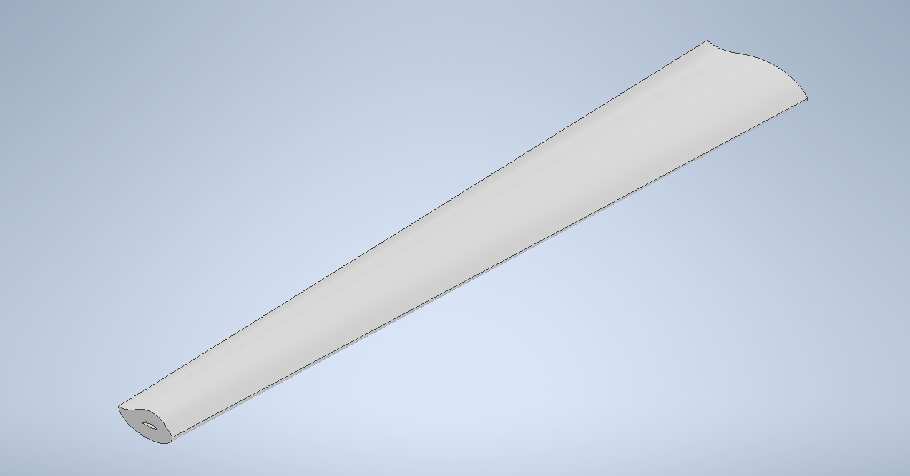

# Renewable-Technology-Challenge
This project was centered around developing an environmentally sustainable wind turbine blade for a proposed Swedish wind farm that would contribute to Sweden’s goal of achieving zero greenhouse gas emissions by 2045.

## Project Objectives
- Design a wind turbine blade for a Swedish wind farm
- Develop a solution with improved environmental sustainability
- Generate usable energy from wind
- Meet Swedish building and safety regulations
- Maintain blade deflection below 10mm

## Final Design

Our team selected **high-carbon steel** as the primary material for the wind turbine blade.

The material was selected based on:
- Recyclability
- High tensile strength
- High melting point
- Excellent fracture toughness
- Strong fatigue resistance

Material selection was evaluated using **Granta EduPack** and a weighted decision matrix.

*Final wind turbine blade design

## My Role - Project Manager

As the project manager, I was responsible for coordinating the team's progress while also contributing to key technical decisions.

### Managerial Contributions

- Oversaw the overall progress and operation of the project
- Divided work among team members and established clear responsibilites
- Conducted regular check-ins to ensure tasks were completed correctly and on time
- Provided support and clarification to team members
- Created a **Gantt chart** to organize project tasks and deadlines

### Technical Contributions

- Finalized the problem statement and objective tree
- Used **Granta EduPack** for material analysis
- Developed and contributed to the weighted material-selection matrix
- Contributed to discussions surrounding material and design considerations

## Tools & Technologies

- **Granta EduPack** - Material selection and analysis
- **Autodesk Inventor** - 3D design and modelling
- **Microsoft Excel** - Data analysis and weighted decision matrix
- **Gantt Chart** - Project planning and scheduling

## Skills Acquired

### Technical Skills

- Materials Selection
- Engineering Design
- 3D Modelling

### Professional Skills

- Project Management
- Team Collaboration
- Time Management
- Oral Communication
- Task Coordination

## Key Takeaways

This project strengthened my understanding of both engineering design and project management. I learned the importance of addressing team challenges early through clear and proactive communication.

I also learned how important it is to align design priorities with the project's primary objective. Using Granta EduPack and a weighted decision matrix helped me understand how engineering decisions can involve balancing environmental, material, and performance requirements.

Overall, the project strengthened my ability to combine **technical analysis, project coordination, and strategic decision-making** when working on an engineering design problem.

